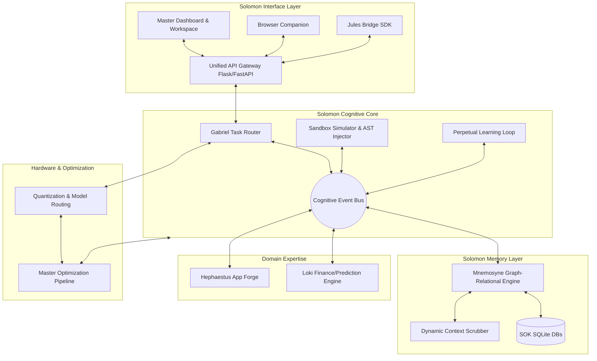

# SOLOMON UNIFIED MASTER ARCHITECTURE (OS v2.0)
## Redesign & Consolidation Strategy

**Architect:** Jules 1 - Supreme Systems Architect

---

## 1. Executive Summary
Project Solomon has evolved rapidly, resulting in fragmented modules, overlapping capabilities (e.g., numerous isolated 50-step optimizers), and a sprawling codebase. This document outlines the authoritative unification of all systems into a single, cohesive, non-redundant ecosystem. Everything connects through clean APIs. Nothing exists twice.

---

## 2. Inventory of Existing Subsystems & Consolidation Strategy

### 2.1 The Cognitive Core & Learning
*   **Existing:** Gabriel Engine, SPLE (Solomon Perpetual Learning Engine), SOSS (Observational Sandbox Simulator), Artificial Cognitive Architecture, Autonomous Growth Loop, Curiosity Engine, Skill Graph.
*   **Consolidation:** Merged into `solomon-core`. All learning, observation, and skill acquisition will route through a unified **Cognitive Event Bus**. The Gabriel Kernel will act as the single task router.

### 2.2 Memory & State
*   **Existing:** Mnemosyne, System of Knowledge (SOK), Knowledge Cards, Dynamic Context, Universal Knowledge Graph, SQLite DB Managers.
*   **Consolidation:** Merged into `solomon-memory`. A single graph-relational hybrid abstraction layer. All modules will use a shared connection pool, eliminating duplicate SQLite instantiation.

### 2.3 Optimization & Hardware
*   **Existing:** 50-step System Optimizers, 50-step Quantization Optimizers, 50-step Gabriel Optimizers, Hephaestus Optimizers, 150-step Dynamic Quantization, Quantization Engine, Automatic Routing.
*   **Consolidation:** Merged into `solomon-hardware` and `solomon-optimizer`. All optimization pipelines are now plugins to a single `MasterOptimizationPipeline` interface, avoiding redundant script runners.

### 2.4 Domain-Specific Engines
*   **Existing:** Loki (Finance/Kalshi/Sports Predictor), Hephaestus App Forge.
*   **Consolidation:** Isolated as distinct service domains (`solomon-finance` and `solomon-forge`). They will only interact with the core via the Event Bus and shared memory API.

### 2.5 Extensibility & Interfacing
*   **Existing:** Jules Bridge, Browser Companion Side Panel, Offline Casino Lab, Unified Dashboard.
*   **Consolidation:** Merged into `solomon-interface`. The Flask API gateway will act as the absolute boundary. The Jules Bridge becomes the standard SDK for all external agent orchestration.

---

## 3. The Master Architecture Diagram



---

## 4. Service Map & Dependency Graph

### Service Map
1.  **Gateway Service:** Routes all HTTP/WS traffic, handles Auth (Bearer Token/Genesis Protocol), Rate Limiting.
2.  **Gabriel Service:** Manages LLM worker swarms, BFT consensus, prompt firewalls.
3.  **Mnemosyne Service:** Manages SOK cards, Vector Embeddings, K-Means Clustering, TTL expiration.
4.  **Hardware Service:** Manages ExL2 Sparse Quantization, Paged-KV Cache, GPU Multiplexing.
5.  **Telemetry Service:** Tracks USD, Energy, Worker Success, Deadlock Heuristics.

### Dependency Graph Rules (Strict Enforcement)
*   `solomon-domain` (Loki, Hephaestus) depends on `solomon-core` & `solomon-memory`.
*   `solomon-core` depends on `solomon-memory` & `solomon-hardware`.
*   `solomon-memory` is independent.
*   `solomon-hardware` is independent.
*   **No Circular Dependencies allowed.** Any cycle will be broken by introducing an Event via the Cognitive Event Bus.

---

## 5. Communication Protocols & Missing Interfaces

### Missing Interfaces Identified
1.  `IEventBus`: Currently, systems call each other's Python methods directly. We need a strict Pub/Sub model for cognitive events (e.g., `MemoryPersisted`, `OptimizationTriggered`).
2.  `IWorkerSwarm`: Standardized interface for OpenAI, Local Quantized Models, and Clean-Room Synthesized Python logic.
3.  `IDataProvider`: Standardized abstraction for fetching data (Kalshi order books, sports data) so Loki isn't tightly coupled to specific web requests.

### Unified Protocols
*   **Synchronous:** RESTful API for all UI, Jules Bridge, and Extension requests. Standardized JSON responses with `data`, `meta`, and `error` keys.
*   **Asynchronous:** WebSocket/Server-Sent Events (SSE) for Telemetry, System Health, and AST injection hot-reload notifications.
*   **Internal Inter-process:** ZeroMQ or Redis Pub/Sub acting as the Cognitive Event Bus for decoupled internal signaling.

---

## 6. Unified Naming Conventions

To eliminate fragmentation, all code will adhere to the following schema:
*   **Modules/Packages:** `snake_case` (e.g., `solomon_memory`, `solomon_core`).
*   **Classes:** `PascalCase` (e.g., `KnowledgeGraph`, `QuantizationOptimizer`).
*   **Methods/Variables:** `snake_case` (e.g., `inject_ast_node`, `active_workers`).
*   **Constants:** `UPPER_SNAKE_CASE` (e.g., `MAX_CONTENT_LENGTH`).
*   **API Endpoints:** `kebab-case` with versioning (e.g., `/api/v2/cognitive-core/run-loop`).
*   **Database Tables:** Plural `snake_case` with domain prefix (e.g., `sok_knowledge_cards`, `loki_kalshi_markets`).

---

## 7. Master Folder Structure

```text
/solomon-os
├── /api                    # Unified API Gateway (Flask/Gunicorn)
│   ├── /routes             # Route definitions by domain
│   ├── /middleware         # Rate limiting, Auth, Genesis Protocol
│   └── app.py              # Main application entrypoint
├── /solomon_core           # SOSS, SPLE, Gabriel Task Router
│   ├── /gabriel            # Swarm consensus, multi-agent logic
│   ├── /sple               # Perpetual learning, Curiosity, Meta-learning
│   └── /soss               # AST Injector, Sandbox, Synthetic Data
├── /solomon_memory         # Mnemosyne, SOK, Graph
│   ├── /models             # SQLAlchemy / SQLite models
│   ├── /graph              # Universal Knowledge Graph logic
│   └── /context            # Context Scrubber, Deduplication
├── /solomon_hardware       # Quantization, Resource Optimizers
│   ├── /quantization       # Hybrid INT8/Sparsity, Model Routing
│   └── /optimization       # Unified Master Optimization Pipeline
├── /solomon_finance        # Loki Predictive Engine
├── /solomon_forge          # Hephaestus App Forge
├── /solomon_interface      # Jules Bridge, Browser Extension backend, CLI
├── /tests                  # Unified test suite mirroring /src structure
├── /deploy                 # render.yaml, systemd, docker configs
└── /docs                   # Unified architecture and phase blueprints
```

---

## 8. Future Expansion Strategy

1.  **Plugin Architecture:** Any new subsystem (e.g., a genomic analysis engine) must be built as a self-contained domain module adhering to the `IDomainService` interface and subscribing to the Cognitive Event Bus.
2.  **Distributed Node Scaling:** Transitioning the Gabriel Kernel from local threading to a Distributed Hash Table (DHT) framework to allow multiple Solomon instances (running on different servers) to share SOK memories and compute loads seamlessly.
3.  **Language Agnostic Microservices:** The unified folder structure and REST/gRPC boundaries prepare the system to rewrite highly intensive mathematical bottlenecks (e.g., `solomon_hardware`) into Rust or C++ without disrupting the Python orchestrator.
