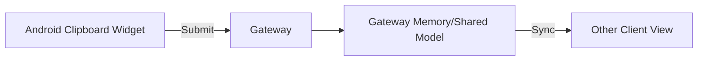
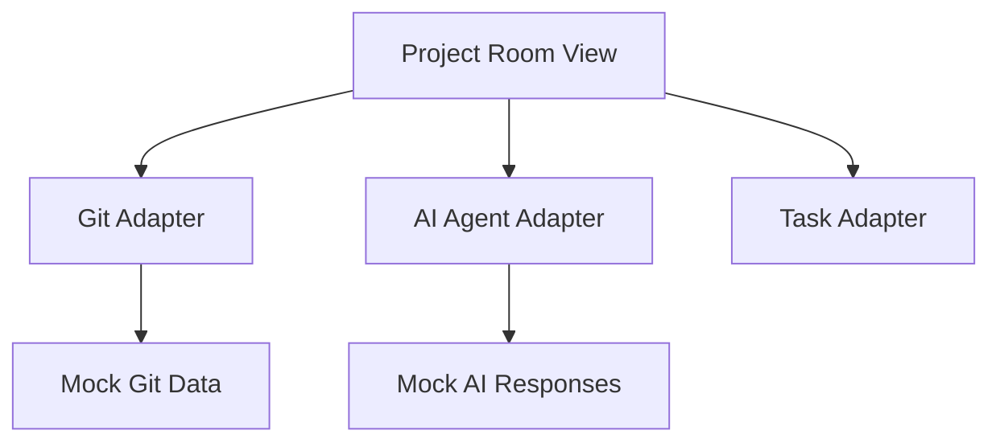

# Component Diagrams

## High-Level Architecture

```mermaid
graph TD
    UI[Android UI / Compose]
    Gateway[Gateway Service / FastAPI]
    Adapters[Mock Adapters]
    Contracts[Adapter Contracts]

    UI -->|REST/WebSockets| Gateway
    Gateway --> Contracts
    Contracts <|-- Adapters
```

## Shared Clipboard



## Project Room


