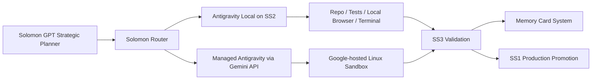
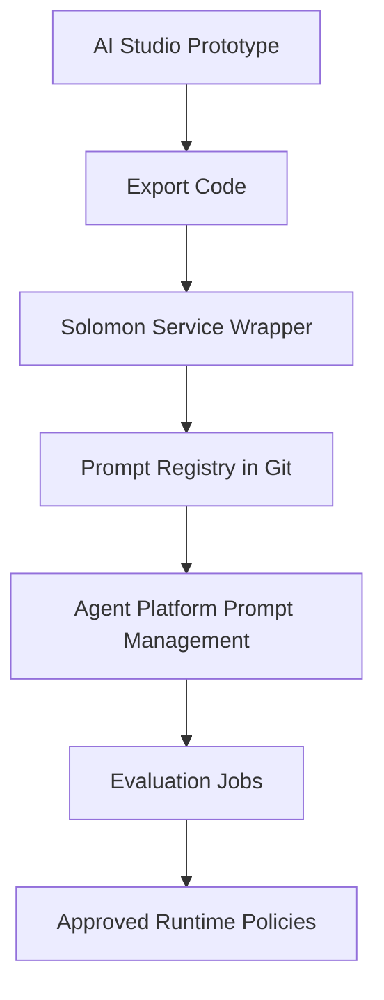
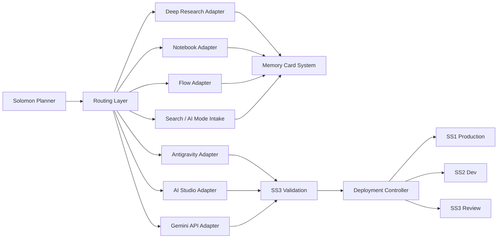

# The Google AI Pro Integration Blueprint for Project Solomon

## Executive synthesis

Project Solomon should treat **Google AI Pro** as a **human-facing capability layer and a privileged developer acceleration layer**, not as Solomon’s production control plane. The subscription gives you materially higher access to Gemini app features, Google Flow credits, Gemini Notebook, AI Mode in Search, AI Studio, Antigravity, Gemini in Android Studio, Chrome auto browse, and monthly Google Cloud credits via the Google Developer Program benefit consolidation. But Google’s own documentation makes clear that many of these surfaces are consumer or prototyping experiences with dynamic, product-specific quotas, while production APIs, prompt/version governance, evaluation tooling, and enterprise deployment patterns live in the **Gemini API / Interactions API** and **Gemini Enterprise Agent Platform** layers. In practice, Solomon should use AI Pro to speed research, prototyping, code generation, and human-supervised agentic work, while routing durable production workloads to the Gemini API and Vertex-based infrastructure.

There are also naming issues worth normalizing up front. In current public Google documentation, “NotebookLM” help is branded as **Gemini Notebook**; “Chrome Agent” is not a separate developer product but is best understood as **Gemini in Chrome plus Chrome auto browse**; “Android Studio Agent” is **Gemini in Android Studio Agent Mode**; and “Search Agent” maps most closely to **AI Mode, Deep Search, and Search information agents** rather than a standalone API product. Your implementation guide should use these canonical names internally so that engineering, procurement, and security do not build around ambiguous labels.

The most important architectural conclusion is this: **Google AI Pro should become Solomon’s “expansion bus” for acquisition, experimentation, and supervised execution, while Solomon’s persistent memory, orchestration logic, and deployment controls remain outside the subscription UX surfaces.** Google gives you extraordinary leverage in research, creative generation, coding agents, Android workflows, and Google-native data access, but the subscription surfaces are not substitutes for your own memory hierarchy, queueing system, review gates, observability stack, or long-term data retention. Solomon should therefore absorb Google’s capabilities as pluggable subsystems behind a stable internal interface: `plan -> acquire context -> execute -> validate -> persist learning -> redeploy`.

## Google AI Pro capability audit

### What Google AI Pro actually includes

As of July 2026, Google AI Pro is publicly positioned as a $19.99/month plan with **4x higher usage access than Free**, **5 TB of storage**, **1,000 Google Flow credits**, **higher access to Gemini 3 Pro / Deep Search / agentic capabilities in Search**, **higher limits in Jules**, **entry rate limits in Google Antigravity**, and **5x more Audio Overviews and more notebooks in Gemini Notebook**. Google also markets Pro as including expanded access to Gemini 3.1 Pro and Deep Research, access to Gemini in Gmail, Docs, Vids, and more, Chrome auto browse in the U.S., and a consolidated premium developer benefit path through the Google Developer Program changes.

That means the AI Pro footprint is broader than “Gemini app access.” For Solomon, the subscription-relevant surfaces are:

- **Gemini app** for fast human-in-the-loop ideation, Deep Research, Live, Canvas, Gems, and model access.
- **Google AI Studio** for API prototyping, code export, Build mode, Android app generation, Workspace-integrated full-stack prototypes, and direct deployment.
- **Google Antigravity** for agentic coding and task execution on desktop/CLI/IDE, with AI Pro-specific higher rate limits.
- **Gemini Notebook** for source-centric knowledge ingestion, reports, data tables, audio/video overviews, and Deep Research imports.
- **Google Flow** and related media models for generative video, image, and custom creative tooling.
- **Search AI Mode / Deep Search / information agents** for search-native research and background monitoring.
- **Gemini in Chrome / auto browse** for browser-native agentic task execution.
- **Gemini in Android Studio Agent Mode** for Android-specific multi-step development.
- **Google Cloud credits** through the Developer Program consolidation for Google Cloud, Firebase, Vertex AI, and Maps workloads.

### Models, APIs, SDKs, and authentication

Google’s current developer stack is now anchored on the **Interactions API**, which Google describes as the best and recommended way to build with Gemini models and agents. It is GA as of June 2026, supports both standard models and specialized agents such as Deep Research and managed agents, includes optional server-side conversation state through `previous_interaction_id`, and supports background execution with `background=true`. Google explicitly says the older `generateContent` API remains supported but is now considered legacy for new development.

For Solomon, the critical API-layer capabilities are:

**Core model families.** Google’s public models catalog includes **Gemini 3.6 Flash**, **Gemini 3.5 Flash**, **Gemini 3.5 Flash-Lite**, **Gemini 3.1 Pro**, **Gemini 3 Flash**, Live/TTS variants, **Gemini Omni Flash**, **Nano Banana 2 / 2 Lite**, **Gemini Deep Research**, **Gemini Deep Research Max**, **Antigravity Agent**, **Computer Use**, and **Gemini Embedding 2**. Google characterizes Gemini 3.6 Flash as balancing speed and intelligence for agentic and multimodal tasks; Gemini 3.5 Flash as most intelligent for sustained frontier performance on agentic and coding tasks; Gemini 3.5 Flash-Lite as a high-throughput execution model; and Gemini 3.1 Pro as advanced intelligence with strong problem-solving and agentic coding.

**SDKs.** Google’s current official SDK path is the **Google Gen AI SDK**, which Google documents as a unified interface for both the Gemini Developer API and the Gemini API on Gemini Enterprise Agent Platform. That is strategically important for Solomon because it means you can prototype against the lighter-weight developer stack and migrate to enterprise deployment without rewriting all integration code.

**Authentication.** On the Gemini Developer API side, Google supports **API keys** and **OAuth**, while recommending API keys for simple starts and OAuth for tighter access controls. AI Studio automatically creates a default project/API key for new users. On the enterprise side, Gemini Enterprise Agent Platform recommends **Application Default Credentials** first, with API keys also supported.

**Built-in tools and function calling.** Google’s tools layer includes built-in tools such as **Google Search**, **Code Execution**, **URL context**, **Computer Use**, and **File Search**, while custom tools are exposed through **Function Calling**. Interactions API also supports **remote MCP servers**, which is the cleanest path for Solomon to expose internal memory retrieval, deployment checks, repo policies, and infrastructure tools to Google models without hard-coding every integration into prompts.

**Rate limits.** Google’s published API rate limits are project-level, measured in **RPM**, **TPM**, and **RPD**, with separate spend-based protections by usage tier. The rate limits page also notes that limits vary by model and that preview/experimental models are more restricted. By contrast, the **consumer AI Pro quotas are largely dynamic and not fully published numerically**; Google states that each product has its own AI usage limits and that Gemini app usage is compute-based, refreshes every five hours, and is also bounded by a weekly limit.

### Quotas, limitations, and common misconceptions

The biggest misconception is that a **Google AI Pro subscription equals production API capacity**. It does not. AI Pro primarily increases access inside Google-owned product surfaces. If Solomon is expected to run durable, autonomous, back-end workloads at scale, those workloads should be budgeted and operated against the **Gemini API** or **Gemini Enterprise Agent Platform**, not the visible limits of the consumer app or desktop surfaces. Google’s own docs separate the consumer subscription experience from AI Studio / Gemini API / enterprise platform guidance.

A second misconception is that the subscription surfaces are “simple wrappers” around one model. They are not. Google now exposes a mixed ecosystem: Gemini reasoning models, Live and TTS modalities, agent harnesses, media models such as Omni and Nano Banana, creative tooling in Flow, Workspace-connected app builders in AI Studio, and search-native research agents. Solomon should therefore not integrate “Google AI Pro” as one box; it should integrate **capability-specific adapters**.

A third misconception is that Google’s dynamic app quotas make AI Pro unusable for serious work. That is also wrong. The better interpretation is that AI Pro is excellent for **high-value, human-supervised work loops**—research, prototyping, code review, creative iteration, and exploratory planning—while the production plane belongs to the API and cloud stack. That split is exactly what Solomon needs: use the subscription to make the architects and reviewers faster, and use the APIs to make the system durable. This is a design inference, but it follows directly from Google’s public product segmentation.

## Antigravity and the managed-agent stack

### What Antigravity is, and how it works

Google describes **Antigravity** as an agent-first development platform spanning a desktop command center, CLI, IDE, and SDK. Public docs describe the same core ideas across those surfaces: a main agent, artifacts, projects spanning multiple workspaces, dynamic subagents, asynchronous task management, scheduled tasks, rules, skills, hooks, browser tools, MCP support, and a permission/sandbox model. The SDK page says the Agent SDK exposes the same tools, agent loop, and context management that power Antigravity itself.

The most important publicly documented architectural facts are these:

- Antigravity can work across **Projects** rather than a single repo, which matters for Solomon’s three-box architecture because SS1, SS2, and SS3 can be surfaced as separate workspaces under a single higher-level project.
- It supports **dynamic subagents** and **asynchronous task management**, explicitly to avoid polluting the main context window and to allow parallel work.
- It has transparent monitoring through `/agents` and `/tasks`, including live status, roles, current step, stdout logs, and detailed reasoning logs for subagents.
- It supports **MCP**, **rules files** such as `GEMINI.md` or `AGENTS.md`, and **JSON hooks**, giving you three different control points: external tool surfaces, persistent workspace policy, and pre/post operation interception.

For Solomon, this means Antigravity is best understood not as “another coding assistant,” but as a **local/desktop agent harness** that can sit between strategic planners and actual engineering execution.

### Sandbox, browser automation, planning, and queueing

Google’s public security model is unusually explicit for Antigravity. In IDE settings, the default workspace boundary limits access to project folders plus local app data under `~/.gemini/antigravity/`. Strict mode can force request-review behavior, disable non-workspace access, respect `.gitignore`, and constrain browser/javascript execution. Terminal sandboxing uses OS-native mechanisms—**`nsjail` on Linux**, **`sandbox-exec` on macOS**, and **AppContainer on Windows**—with policy toggles and optional network restrictions.

Browser automation is implemented through a **Browser Subagent** that can actuate a local Chrome browser, capture screenshots, and save action videos as artifacts. Google also documents a separate Chrome profile and allowlist/denylist controls as part of the browser security model.

Planning is both explicit and implicit. Antigravity has a `/planning` mode, artifact review flows, and slash commands such as `/goal` to run to completion, `/grill-me` to ask clarifying questions before implementation, and `/schedule` for one-time or recurring execution. Google’s 2.0 launch blog also confirms **Scheduled Tasks** as a first-class primitive.

Queueing and large-project handling are not described as a centralized “job queue” in the sense of a distributed workflow engine, but the public docs make clear that long-running work is delegated to **parallel subagents or background tasks**, surfaced in `/agents` and `/tasks`, and can continue while the primary conversation remains active. That is enough for Solomon to treat Antigravity as a **front-end execution fabric**, while keeping the true scheduling and retry logic in Solomon’s own orchestrator.

### Antigravity API access and Solomon-specific deployment pattern

Antigravity is not only a product UI. Through the Gemini API, Google now exposes **managed agents** with a predefined **Antigravity agent** that provisions a Google-hosted Linux sandbox, runs code, manages files, and browses the web autonomously. Google further documents that custom managed agents can extend the base agent with instructions, skills, and data, and that AI Studio has a visual Playground for building and testing those agents.

That gives Solomon two distinct Antigravity integration paths:

**Local execution path.** Use the desktop/CLI/IDE products on SS2 and SS3, where codebase access, human approval, visual debugging, and workstation-attached resources matter most. This is the right choice for repo surgery, test runs, migrations, and artifact review.

**Remote managed-agent path.** Use the Gemini API managed-agent/Antigravity path for cloud-hosted tasks that need browser access, code execution, and isolation but do not require deep local workstation context. This is the right choice for autonomous analysis, environment-independent reproduction, large research sweeps, and ephemeral execution.

The right Solomon pattern is therefore **hybrid**:



This design lets Solomon keep memory, approval, and promotion logic inside its own architecture while exploiting both local and Google-hosted agentic execution.

### Where Antigravity exceeds Codex, and where Codex still wins

Antigravity’s strongest documented advantages are its **multi-workspace Project model**, **dynamic subagents**, **Scheduled Tasks**, **rules/skills/hooks stack**, **browser subagent**, and a first-party bridge into Google-native surfaces such as AI Studio and Android workflows. It is also positioned as part of a wider Google agent ecosystem rather than a standalone coding tool.

Codex, by contrast, benefits from tighter integration with ChatGPT subscriptions and strong API-aligned pricing visibility; OpenAI states that Codex pricing shifted in April 2026 to align with API token usage, and its pricing page emphasizes Codex availability across ChatGPT plans. For organizations already centered on OpenAI chat/stateful coding flows, Codex may still feel more unified across drafting, reasoning, and coding.

For Solomon, the right answer is not replacement but role separation. Use **Antigravity** when you need project-scoped, browser-capable, Google-native, policy-driven agentic execution. Use **Codex** when you want OpenAI-native cloud workflows, stronger cross-chat integration with existing ChatGPT operations, or comparative redundancy during production validation. That recommendation is an inference from the documented product positioning and pricing models, not a claim of benchmark superiority.

## Deep Research, AI Studio, and Gemini Notebook as Solomon’s acquisition layer

### Deep Research as Solomon’s strategic intelligence engine

Google’s public Deep Research documentation is unusually clear: the **Gemini Deep Research Agent** autonomously plans, executes, and synthesizes multi-step research tasks across complex information landscapes, can incorporate documents directly as input, can connect to external tools via MCP, can include visualizations such as charts and graphs, and is currently available only through the **Interactions API**. It is also explicitly long-running and must use **background execution**. Google lists both **Gemini Deep Research Preview** and **Gemini Deep Research Max Preview**, with the latter positioned for maximum comprehensiveness across hundreds of sources.

For Solomon, Deep Research should not be treated as an occasional “write me a report” utility. It should become the **primary external knowledge acquisition engine** for anything that requires cross-source synthesis, citation, and iterative discovery. The best repeatable pattern is:

1. **Strategic framing** in Solomon GPT.
2. **Deep Research run** with background execution.
3. **Source extraction and report normalization** into Memory Cards.
4. **Gap analysis** by Solomon against existing memory.
5. **Follow-on targeted Deep Research tasks** for unresolved unknowns.
6. **Validation pass** in SS3 using Antigravity or Codex against critical claims.
7. **Promotion into durable knowledge stores** with provenance.

Prompt structure matters. Google’s docs emphasize collaborative planning, MCP connectivity, and document inputs. The most effective Solomon prompt template should therefore contain five blocks: **objective**, **decision context**, **required deliverable shape**, **known constraints**, and **required evidence posture**. Avoid vague “research X” prompts. Instead, ask for hypothesis testing, trade-off analysis, source grouping, confidence labels, and explicit unknowns. This is consistent with how Google positions Deep Research as an agentic planner/executor rather than a plain chat completion.

A strong Solomon Deep Research template would look conceptually like this:

```text
Mission:
Determine the best architecture choice for [topic].

Decision context:
This will inform a production system used for [purpose].

Required outputs:
- Executive recommendation
- Alternatives considered
- Risks and failure modes
- Cost and quota implications
- Citations grouped by sub-claim
- Open questions requiring follow-up research

Constraints:
Prefer official documentation, then primary-source technical material.
Note when data is preview-only, region-limited, or quota-limited.

Evidence posture:
Distinguish confirmed facts from inference.
```

That format is not copied from Google, but it is aligned with the Deep Research agent’s documented abilities and yields outputs that are easier to convert into durable memory.

### AI Studio as the prototyping, routing, and experimentation layer

Google AI Studio remains the fastest way to try models and experiment with prompts, but its scope expanded significantly in 2026. Beyond prompt playground behavior, AI Studio now includes **Agents Playground**, **Build mode for web apps**, **native Android app generation**, **Google Workspace integrations**, **Firebase provisioning**, and **direct deployment** to managed infrastructure. Google also positions it as the fastest path from prompt to a production app and notes a forthcoming mobile app.

AI Studio is where Solomon should do the following work:

**Function calling and tool calling prototyping.** Use AI Studio to iterate on function schemas, tool routing prompts, and grounding patterns, then export code into the Solomon service layer. Google’s quickstart explicitly notes structured output, function calling, code execution, and grounding toggles in Run settings.

**Long-context experiments.** AI Studio publicly highlights a **1 million token context window**. Solomon should use this for evaluation of large design docs, architecture memos, and policy bundles before deciding what must become persistent retrieval material vs. ephemeral prompt context.

**Model routing tests.** Because the Gemini catalog now spans Flash, Pro, Live, Deep Research, Antigravity, embeddings, Omni, Nano Banana, and Computer Use, AI Studio is the right laboratory for building Solomon’s routing policy. Use it to answer questions such as: when is Flash enough, when is Pro required, when should a task become a managed agent, when should media generation be separated, and when should multimodal retrieval be used.

**Prompt regression.** AI Studio itself is not the long-term source of enterprise prompt governance. Google’s production prompt management, versioning, sharing, evaluation, and optimization features are documented under Gemini Enterprise Agent Platform / Vertex AI tooling. The right Solomon design is to prototype in AI Studio, but check all production prompts into Git and mirror important prompt assets into Agent Platform prompt management for versioning and optimization. This is a design recommendation based on Google’s separation of prototyping and enterprise governance docs.

A good high-level pattern is:



### Gemini Notebook as Solomon’s ingestion and source-grounding front end

Current Google help documentation makes clear that **Gemini Notebook** is now a source-centric project space: each notebook is independent, contains its own source collection, and can generate summaries, notes, reports, data tables, mind maps, audio overviews, and video overviews. Reports and tables can be exported into Google Docs and Sheets.

Notebook is especially valuable for Solomon because it already behaves like a semi-structured ingestion workbench. It can import files and discover sources, organize them automatically into labels when you have enough material, and—critically—can use **Fast Research** or **Gemini Deep Research directly inside the source panel**. When Deep Research is used inside Notebook, Google says you can import the generated report plus relevant cited and uncited sources into the notebook.

This makes Notebook the ideal **stage-zero ingestion layer** for unstructured knowledge objects:

- books and PDF manuals,
- research papers,
- video-associated written materials,
- lecture notes,
- product docs,
- design documents,
- engineering specifications,
- meeting materials, and
- externally researched topic packets.

There are important limits. Standard Notebook limits are publicly documented as **100 notebooks**, each with up to **50 sources** and **500,000 words per source**, plus a daily limit of **50 chat questions** and **3 audio generations**; local uploads are limited to **200 MB** per source and there is no page cap. Google also states that higher plans raise limits, and enterprise/cloud variants can increase artifact limits by 5x or more.

For Solomon, the right Notebook pattern is not to make Notebook the memory system itself. Instead:

**Notebook = ingestion and synthesis front end.**
**Memory Card System = durable, queryable semantic memory back end.**

The bridge should work like this:

1. A human or agent loads a subject packet into Notebook.
2. Notebook generates summaries, reports, tables, and overviews.
3. Solomon ingests both the original sources and the Notebook outputs.
4. A memory normalization service converts the content into:
   - canonical entities,
   - claims with provenance,
   - task-relevant embeddings,
   - reusable summaries,
   - contradiction markers,
   - freshness metadata.
5. Solomon stores those as Memory Cards plus vector/search indexes.

Where Google’s File Search matters here is persistence. File Search stores keep embeddings indefinitely until manually deleted, while raw uploaded files expire after 48 hours; File Search also supports multimodal embeddings through **Gemini Embedding 2**, though audio/video are not currently supported. So the best Solomon design is to export Notebook-approved source corpora into a managed **File Search store** or a parallel Vertex/vector system for production retrieval, rather than relying on Notebook alone for enduring access.

## Solomon target architecture and perpetual learning design

### The control-plane design

Solomon already has the right primitive concepts: a strategic interface, local Ubuntu servers, persistent semantic memory, and a three-box SS1/SS2/SS3 model. Google AI Pro should be integrated by assigning each Google surface a strict architectural role rather than letting capability sprawl become architecture. The recommended ownership model is:

**Memory ownership:** Solomon Memory Card System plus File Search / vector back ends for Google-originated corpora. Google surfaces may generate artifacts, but they do not own final memory.

**Planning ownership:** Solomon GPT owns top-level planning. Deep Research owns external knowledge planning for research tasks. Antigravity / managed agents own local execution planning after receiving bounded objectives.

**Execution ownership:** Antigravity local for repo work and workstation-attached tasks; managed agents for sandboxed cloud execution; AI Studio Build mode for fast prototypes; Android Studio Agent Mode for Android-specific execution; Flow for media generation.

**Review ownership:** SS3 plus human reviewers. Antigravity artifact review, Git diffs, tests, and additional cross-model validation through Codex/other tools should feed into SS3 before SS1 promotion.

**Deployment ownership:** Cloud-native deployment should be owned by Solomon’s CI/CD and Google Cloud services, not by AI Studio’s one-click publish path, except for disposable prototypes. AI Studio deployment is useful for rapid prototypes, but its Starter Tier is intentionally limited.

### The communication fabric

The cleanest implementation is an internal event bus with bounded adapters around each Google subsystem:



The routing layer should make decisions using six task classes:

**Research tasks.** Route first to Deep Research or Search AI Mode; store outputs as research packets.

**Knowledge ingestion tasks.** Route to Notebook for human-supervised ingestion and artifact generation, then to File Search/vector memory.

**Code execution tasks.** Route to Antigravity local when repo proximity matters; managed agents when environment isolation matters.

**Prototype tasks.** Route to AI Studio Build mode for disposable apps, Workspace-integrated tools, and Android experiments.

**Creative/media tasks.** Route to Flow, Nano Banana, Omni, and Veo-family surfaces.

**Monitoring tasks.** Route to Search information agents and Scheduled Tasks where surface-native monitoring is useful, but replicate findings into Solomon-controlled schedules for reliability.

### The perpetual learning engine

A continuously learning Solomon needs more than retrieval. It needs a closed loop:

**Read / watch / listen.** Use Notebook ingestion, Deep Research, Search AI Mode, and media-capable Gemini APIs to turn external material into normalized knowledge packets. Notebook can already generate reports, tables, audio, and video overviews from uploaded corpora.

**Summarize / store / index.** Convert every accepted packet into Memory Cards with provenance, embeddings, freshness, contradiction status, and suggested downstream actions. File Search stores and Gemini Embedding 2 give Google-native retrieval options; Vertex/vector infrastructure should hold the production index.

**Improve prompts / code / architecture.** Use Agent Platform prompt management, prompt optimizer, and Gen AI evaluation service to refine system instructions and routing prompts over time. Google explicitly documents prompt versioning, sharing, optimization, and evaluation under the enterprise platform.

**Identify knowledge gaps and schedule future learning.** Search information agents can watch topics in the background, and Antigravity Scheduled Tasks can run on recurrence. Solomon should additionally maintain its own “gap registry” keyed by capability, subsystem, benchmark, or unresolved decision, then auto-issue Deep Research or ingestion jobs against that registry.

**Generate experiments and measure success.** Every change to prompts, code, architecture, or routing policy should create an evaluation job. Google’s evaluation service is the natural fit for model/prompt quality, while Solomon should add its own engineering KPIs: bug escape rate, PR cycle time, failed deployment recovery time, retrieval precision, and percentage of Memory Cards reused in subsequent work.

## Cloud credit allocation and deployment roadmap

### How the Google Cloud credits should actually be spent

Google’s current Developer Program benefit FAQ says premium benefits for personal accounts are being consolidated into Google AI Pro and AI Ultra and that subscribers receive **$10, $40, or $100 in Google Cloud credits per month**, depending on plan. Those credits can be used on all **Google Cloud Platform** and **Google Maps Platform** products, including **Firebase** and **Vertex AI**, and credits expire one year after grant.

For Project Solomon, the highest-leverage spend order is:

**First: observability and control plane.** Fund logging, monitoring, artifact storage, Cloud Run/Functions, and lightweight durable databases first. Autonomous systems fail in opaque ways; observability compounds every other investment. Google’s enterprise platform docs emphasize observability and tracing as a core agent platform feature.

**Second: retrieval and memory infrastructure.** Spend on persistent storage, vector search / retrieval layers, and File Search or Vertex-native retrieval components. Knowledge accumulation is Solomon’s moat, so the credits should strengthen durable ingestion and retrieval more than they subsidize high-cost ad hoc generation.

**Third: execution substrates.** Cloud Run, serverless functions, and controlled CI/CD runners should be the place where Solomon operationalizes approved agents and background research jobs. AI Studio’s deployment path is useful for prototypes, but Solomon’s enduring services should live in standard cloud deployment workflows.

**Fourth: Vertex / Agent Platform services.** Use the credits to stand up enterprise prompt management, evaluation, gateway/security, and governed agent deployment. The point is not just inference spend; it is reducing operational entropy.

**Fifth: Maps and Search-adjacent utilities only where workflow-critical.** These are valuable for domain-specific workflows, but they should not crowd out memory and infrastructure.

One important budgeting caveat: Google states that the **$300 Google Cloud Free Trial no longer applies to Gemini API usage** as of March 2026. So if Solomon wants credits to stretch further, it should route “production Google generation” through the cloud/Vertex side where the program credits help, rather than assuming the consumer/developer free-trial path will subsidize API-heavy work.

### Deployment roadmap

#### First month

In the first 30 days, the objective is **interface stabilization and role separation**. Set up the Google integrations, but do not let teams use them ad hoc. Standardize terminology, create adapters for Deep Research, Notebook, Antigravity, AI Studio, Search AI Mode intake, and Flow, and define what each is allowed to do in SS2 and SS3. Authority should remain human-approved, with no direct SS1 writes from any Google surface. This phase should also stand up a prompt registry, a Memory Card ingestion pipeline, and a minimal evaluation harness. These recommendations follow from Google’s split between prototyping, managed agents, enterprise prompt management, and deployment controls.

#### First quarter

By 90 days, Solomon should have **repeatable research and ingestion pipelines**. Deep Research should feed a formal research queue, Notebook should be the standard front end for unstructured source packets, and Antigravity should be embedded into the SS2 engineering workflow with workspace rules, hooks, and MCP-based internal tools. Move from “people trying tools” to “the system running known workflows.” Success metrics should include research turnaround time, percentage of reports successfully normalized into Memory Cards, number of validated code changes from Antigravity, and retrieval hit rate from production memory.

#### Half year

At 6 months, the target is **governed cloud execution**. Stand up managed-agent workloads through the Gemini API for selected remote tasks, begin using Agent Platform prompt management and evaluation for production prompts, and move the most valuable Google-powered workflows off the consumer UX into a tracked service layer. Cloud credits at this point should predominantly support observability, retrieval, sandboxed execution, and evaluation.

#### One year

At 1 year, Solomon should operate a **dual-plane autonomous system**: a human-supervised capability plane on AI Pro surfaces and a governed production plane on Gemini API / Vertex / Solomon infrastructure. Search information agents, Deep Research, Notebook, and scheduled coding/review tasks should all be feeding a living knowledge graph and experiment backlog. Failures should be recoverable through task replay, state snapshots, and cross-model validation.

#### Multi-year horizon

At 3 to 5 years, the aim is **self-improving architected autonomy**. Google’s public roadmap signals continued expansion in agents, mobile AI Studio, Android-native generation, Search agents, and media models; Solomon should be ready to plug new Google capabilities into a stable internal API rather than refactoring the whole system whenever Google ships a new surface. In other words, build the adapter architecture once, then let Google’s capability curve compound inside it. That is the durable strategy.

## Competitive analysis and final strategic recommendations

### How Google’s stack compares

Against **OpenAI/Codex**, Google is currently stronger in the breadth of its integrated ecosystem: Search, Workspace, Android, Chrome, Notebook, Flow, Antigravity, AI Studio, and agent APIs can all participate in one operating picture. OpenAI, however, still benefits from a more unified chat-centric developer mental model and broadly understood subscription/API packaging. OpenAI’s own pricing pages show Codex included across ChatGPT plans and now aligned with token-style usage accounting. Solomon should keep Codex as a comparative execution and review engine, but Google is the better substrate for **ecosystem-level automation**.

Against **Claude Code**, Google’s advantage is platform breadth and Google-native integrations; Anthropic’s advantage is still the developer affection around Claude-family coding behavior and a clean API pricing surface. Anthropic’s platform docs publish token pricing clearly, but Google’s differentiator is that coding is only one piece of a broader agent and knowledge ecosystem. Solomon should use Claude Code as a high-value secondary coding/review engine, especially when model diversity is strategically useful, but not as the core integrator of memory, search, Workspace, and cloud governance.

Against **GitHub Copilot**, Google’s strongest edge is agentic breadth. GitHub has moved Copilot toward usage-based billing with plans spanning Free through Pro/Business/Enterprise, and Copilot now consumes AI Credits for chat, agent mode, reviews, cloud agent, and CLI. Copilot remains strong for organizations already standardized on GitHub, especially for inline IDE workflows and administrative simplicity. But Solomon’s requirements go beyond repo assistance into research, memory, search, and autonomous learning; Google’s stack is better matched to that system-level ambition.

Against **Cursor**, Google’s weakness is polish consistency across surfaces, while Cursor’s strength is a very focused developer experience with plans for individuals and teams, MCP/skills/hooks, cloud agents, and team analytics. Cursor is still one of the best “single front door” coding environments for individual engineers and small teams. Solomon should use Cursor tactically for developers who move fastest there, but not as the canonical memory or orchestration layer. Cursor should be a leaf node in the architecture, not the trunk.

Against **OpenHands**, Google wins on first-party integration, managed services, and stronger product surface coverage. OpenHands itself positions as an open, model-agnostic platform that can run locally, in its cloud, or self-hosted, with open-source/free entry and BYOK patterns. OpenHands remains valuable for Solomon as an **open control group** and for workflows that demand maximal model/provider portability. But for Google-native automation, Antigravity plus Gemini managed agents are the more strategically aligned choice.

Against the **open-source agent stack**—**Aider**, **Cline**, **OpenCode**, and the now-Cursor-absorbed **Continue**—Google is stronger in governed enterprise extensibility and multi-product depth, while the open-source tools remain stronger in portability, hackability, BYOK economics, and low-vendor-lock-in experimentation. Aider is explicitly a free terminal pair-programming tool; Cline is free for individuals and charges only for inference; OpenCode is open-source, can connect to many model providers, and also offers low-cost model subscriptions. These tools should absolutely stay in Solomon’s sandbox, but chiefly as **execution alternates and cost-control levers**, not as the single system of record.

For **Windsurf** and **Roo Code**, the strategic recommendation is more conservative. Windsurf remains an important coding-agent competitor in the market, and Roo Code remains part of the open-agent conversation, but this audit did not recover a robust set of official primary-source pricing and product docs for them comparable to the products above. For Solomon, that means they can be evaluated tactically, but they should not become first-tier dependencies ahead of platforms with better-documented governance, APIs, and roadmap visibility.

### Final blueprint recommendations

The blueprint for Solomon is therefore:

**Use Google AI Pro as a privileged operator layer.** Give architects, researchers, and reviewers access to Pro for Gemini app, Notebook, Search AI Mode, Flow, AI Studio, Antigravity, Chrome, and Android Studio acceleration. Do not let those surfaces become production truth stores.

**Make Deep Research the default external intelligence acquisition engine.** Chain Deep Research tasks, normalize them into Memory Cards, and schedule refreshes around strategic topics. Use Deep Research Max selectively when breadth matters more than cost/latency.

**Use Gemini Notebook as front-end ingestion, not final memory.** Notebook should be the place where humans and agents assemble corpora, generate artifact summaries, and export approved knowledge into Solomon’s long-term stores.

**Use AI Studio for prototyping and Build mode, then graduate serious systems into Gemini API and Agent Platform.** Prototype quickly, but version prompts in Git/Agent Platform, evaluate them with the Gen AI evaluation service, and deploy with governed cloud infrastructure.

**Use Antigravity as Solomon’s engineering execution bus.** Local Antigravity on SS2/SS3 should own repo-native execution; managed Antigravity agents should own cloud-isolated long-running tasks. Use MCP, rules, hooks, and scheduled tasks aggressively.

**Spend Cloud credits on infrastructure that compounds.** Prioritize observability, retrieval, storage, CI/CD, and Vertex/Agent Platform governance over one-off generation. Those investments make every future model improvement more valuable.

**Keep a multi-vendor review plane.** Google should be the main growth partner for Solomon because of ecosystem fit, but OpenAI, Claude, Cursor, and open-source agents should remain in the review matrix for redundancy, benchmarking, and vendor leverage.

If Project Solomon follows that blueprint, Google AI Pro becomes not a loose collection of premium features, but a deliberate subsystem: **research front end, ingestion front end, prototype lab, local execution bus, cloud-managed agent option, and Google-native productivity bridge—each subordinate to Solomon’s own memory, routing, validation, and deployment architecture.** That is the integration pattern most likely to maximize capability, extensibility, and autonomous growth over the next several years.
