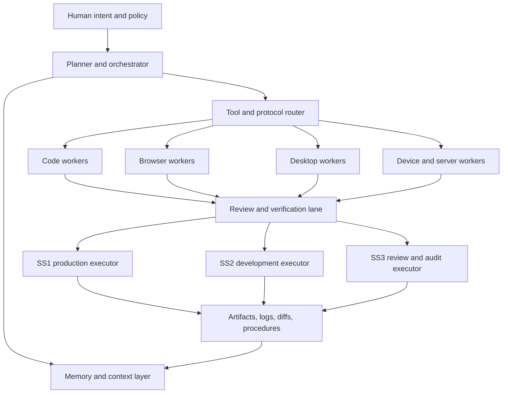

# Solomon Engineering Research Blueprint

*Current snapshot: July 20, 2026.*

## Executive overview

Solomon is technically feasible today without copying any one proprietary system. The core capabilities you want already exist, in separable layers: cloud coding agents that can work in parallel, local IDE and terminal agents that can read and edit repositories, browser and computer-use systems that can operate software through screenshots and UI actions, native operating-system automation surfaces, device-management toolchains, and open interoperability standards such as MCP and ACP. The strongest engineering conclusion is that Solomon should be built as a **composed platform** rather than a single giant model or monolith.

The most important design choice is to separate **reasoning and orchestration** from **execution surfaces**. Modern systems that work well in practice do not rely on one universal “do everything” loop. They combine planning, tool use, error recovery, state persistence, and sometimes reflection or skill reuse. That pattern shows up in ReAct, Reflexion, Voyager, Letta, LangGraph, OpenAI’s Agents SDK, and multiple production agent products. Solomon should follow that same pattern, but with stronger governance around environments and promotions.

The short version of the build recommendation is this: use **OpenHands as the self-hosted developer control plane**, **LangGraph or the OpenAI Agents SDK as the brain-level orchestration layer**, **MCP as the default tool protocol**, **Playwright as the primary browser substrate**, **OS-native automation APIs before screenshot clicking**, and **stateful memory built around a git-trackable procedure and knowledge store inspired by Letta, Reflexion, and Voyager**. That combination gives you the broadest capability coverage with the least unnecessary dependence on fragile or discontinued projects.

## Market landscape

The current coding-agent market has split into a few stable categories: **cloud async engineers**, **interactive local coding agents**, **GitHub-native automation agents**, **self-hostable open-source agent runtimes**, and **research/evaluation agents**. For Solomon, the practical question is not “which one wins,” but “which one contributes the strongest architectural idea.”

| System | Operating model | What it contributes to Solomon | Current signal |
|---|---|---|---|
| Codex | Cloud agent plus local Apache-licensed CLI and IDE extension | Best reference design for **parallel delegated software work**, worktrees, cloud environments, and editor handoff | Official product pages describe parallel agents, cloud environments, worktrees, and a local OSS CLI. |
| Claude Code | Terminal, IDE, desktop, browser, and GitHub Actions workflows | Strong pattern for **interactive local engineering**, repo-aware edits, command execution, and GitHub-triggered automation | Official docs describe reading the codebase, editing files, running commands, and operating through GitHub Actions. |
| Jules | Asynchronous cloud VM tied to GitHub, with API access | Strong pattern for **backlog offloading** and cloud execution detached from the local workstation | Official docs say Jules clones repos into a cloud VM, plans work, verifies changes, integrates with GitHub, and exposes an API. |
| GitHub Copilot | IDE assistance plus cloud agent, sandboxes, automations, and agent apps | Best reference for **GitHub-native enterprise integration**, branch-based work, secure local/cloud sandboxes, and scheduled runs | GitHub documents cloud agents, cloud and local sandboxes, automations, and agent management. |
| Cline | Open-source runtime available as SDK, IDE extension, and CLI | Best open-source reference for a **programmable local coding-agent runtime** with MCP support and reviewable diffs | Official site and repo describe Cline as an open coding agent with Plan/Act modes, MCP integration, CLI/SDK use, and frequent current releases. |
| OpenHands | Self-hosted developer control center for multiple agents and backends | Best candidate for Solomon’s **self-hosted lab and multi-agent execution hub** | OpenHands positions itself as a self-hosted control center that can run OpenHands, Claude Code, Codex, Gemini, or any ACP-compatible agent. |
| SWE-agent | Configurable issue-to-patch agent tuned for repos and evaluation | Best reference for **benchmark-oriented software-issue solving** and for building Solomon’s eval harness | Official docs describe autonomous issue fixing in real GitHub repos and position SWE-agent as a leading open-source project on SWE-bench. |
| Aider | Terminal-first pair programmer directly in git repos | Very useful as a **narrow, dependable local complement** for direct repo edits and human-supervised work | Official docs and repo position Aider as an AI pair programmer in the terminal that works directly with git. |

The strongest “best by role” judgment is therefore straightforward. **Codex** is the clearest reference for multi-agent parallel engineering; **Claude Code** is one of the clearest references for interactive local coding plus GitHub workflows; **Jules** is a strong reference for async cloud backlog execution; **GitHub Copilot** is the cleanest GitHub-native enterprise model; **Cline** is the most important open-source coding-agent runtime to study; and **OpenHands** is the most important self-hosted control-plane candidate.

Just as important, several once-prominent projects are no longer good first-wave dependencies. **OpenDevin has been renamed to OpenHands**; **AutoGen is in maintenance mode**; **Semantic Kernel has been succeeded by Microsoft Agent Framework**; **Continue has been acquired by Cursor**; and **Roo Code was shut down and archived on May 15, 2026**. Those facts do not make any of them wilderness-ready, but they do make them weaker anchors for a greenfield long-term platform.

One additional caution: the old “Windsurf” line appears to be in transition. Official documentation still exposes Windsurf plugins and features, but the main IDE documentation is currently branded **Devin Desktop**, and Windsurf review docs also point users toward Devin-branded review tooling. For Solomon, that means you can learn from the product line, but you should treat its branding and packaging as a moving target rather than a stable dependency name.

## Automation and device surfaces

The single most important implementation rule for Solomon is this: **prefer deterministic, semantic interfaces first; use screenshot-and-cursor control only when there is no durable API**. Browsers have rich automation layers; desktop operating systems expose accessibility and automation APIs; infrastructure has terminal and API surfaces; many devices already support sanctioned management tools. Computer-use models are powerful, but they should be Solomon’s fallback layer, not its default one.

| Surface | Preferred substrate | Secondary substrate | Solomon recommendation |
|---|---|---|---|
| Web apps and browser tasks | Playwright | Selenium/WebDriver, Puppeteer, CDP | Make **Playwright** the default because it is explicitly designed for testing, scripting, and AI agents across Chromium, Firefox, and WebKit. Keep Selenium/WebDriver for standards-heavy compatibility and Puppeteer/CDP for Chromium-deep inspection. |
| Browser tasks with no stable DOM hooks | OpenAI Computer Use or Anthropic computer use | Custom screenshot-action harness | Use computer-use models only when DOM automation, API calls, or explicit test hooks are unavailable. OpenAI documents UI-level computer use; Anthropic documents computer use as a client-side tool. |
| macOS desktop automation | AppleScript and Shortcuts for scriptable apps | Accessibility API and UI scripting | Prefer AppleScript and Shortcuts where apps support them; fall back to AXUIElement-based accessibility control and UI scripting when they do not. |
| Windows desktop automation | PowerShell and Windows UI Automation | SendInput only for last-mile actions | Use PowerShell for system tasks and UI Automation for semantic desktop control. Reserve SendInput for low-level fallback because Microsoft documents integrity-level limitations. |
| Linux desktop automation | SSH/CLI and desktop-native accessibility | XDG portals, then xdotool on X11 only | Prefer command-line control and semantic AT-SPI access; use XDG portals for screenshots in sandboxed settings; treat xdotool as X11-specific legacy fallback, especially because Wayland compatibility is limited. |
| Android devices | adb and fastboot | UI automation or computer use above that | The official Android Platform-Tools stack already covers device connection, shell access, flashing, and bootloader interactions. Start there. |
| Apple mobile devices | Finder / Apple Devices backups and restores; Apple Configurator for deployment; XCTest/XCUIAutomation for app testing | Visual automation only inside approved test contexts | Use Apple’s supported management and testing interfaces, not attempts to bypass normal platform boundaries. |
| Raspberry Pi and embedded devices | Raspberry Pi Imager/SSH/Connect, ESP-IDF, Arduino CLI | Screen automation only when necessary | These ecosystems already expose first-class installation, build, upload, and remote-management tooling. Solomon should sit on top of those interfaces rather than imitate them. |
| Servers and clusters | OpenSSH, Docker, kubectl, Ansible | Browser/Desktop automation only for consoles without APIs | For real administration work, Solomon should operate through the same secure, declarative surfaces human operators use. |

That matrix yields a simple architectural doctrine. Solomon should have **four execution classes**: browser workers, desktop workers, device workers, and server workers. Each class should pick the most structured tool available in its domain; genuine computer-use models should be invoked only when those structured paths fail or do not exist. This is both more reliable and easier to govern.

## Solomon reference architecture

The best Solomon architecture is a **governed, layered engineering system**: a planner at the top, a memory and context layer underneath it, specialized workers below that, and strict review and promotion lanes around every meaningful state change. This is an engineering interpretation of the patterns seen in ReAct, Reflexion, Voyager, Letta, LangGraph, OpenAI Agents SDK, OpenHands, and modern cloud coding agents.

In practice, the planner should decide **what kind of worker** should handle each step and **what level of autonomy** is permitted. The memory layer should store repository knowledge, environment facts, prior successful procedures, failures, reflections, and reusable skills. The tool layer should expose MCP servers by default, ACP where editor interoperability matters, and direct APIs or CLIs where a protocol bridge is unnecessary. LangGraph and the OpenAI Agents SDK are both strong orchestration foundations for this because they explicitly target long-running, stateful, tool-using agents; OpenHands is the strongest candidate for the self-hosted coding-agent operations plane around them.

Your SS1/SS2/SS3 governance idea is one of the strongest parts of the overall concept because it aligns naturally with established security guidance on separating development, testing, and operational environments. NIST’s SSDF explicitly recommends separating and protecting each software-development environment, and NIST SP 800-53 guidance includes separate baseline configurations and isolated test environments. In other words, SS1/SS2/SS3 is not just a project convention; it maps well onto standard security architecture principles.

| Lane | Role in Solomon | Tooling bias | Promotion rule |
|---|---|---|---|
| SS1 | Production executor for real assets, deployments, and live systems | Highly scoped tools, reversible operations, narrow network and filesystem permissions | Require explicit policy gates and human approval for risky actions. This matches modern sandbox and control guidance. |
| SS2 | Development executor for autonomous build, test, refactor, repo analysis, and local experimentation | Broadest agent freedom, but only inside dev sandboxes or isolated worktrees/containers | Promote only through tests, review, and artifact capture. |
| SS3 | Review, audit, and verification lane | Security scanning, CI, policy checks, trace review, diff inspection, and cross-checking | Only SS3 can recommend passage into SS1. |

For memory, the best conceptual model is not “one giant vector database.” Solomon needs at least three memory classes: **working memory** for the active task, **episodic memory** for what succeeded or failed on prior runs, and **procedural or skill memory** for reusable workflows. Reflexion provides the episodic reflection idea, Voyager provides the growing skill-library idea, and Letta provides the strongest memory-first implementation direction, including explicit claims around stateful agents and git-tracked memory concepts.

## Integration priorities

If the goal is to build the **most capable Solomon in the fewest irreversible steps**, the right question is “what should be integrated first,” not “what product has the best branding.” On that criterion, the priorities are clear.

| Ability | Strongest current references | Solomon should do this |
|---|---|---|
| Parallel cloud engineering | Codex, Jules, Devin | Use these as reference patterns for **delegated backlog execution** and branch-or-worktree isolation, but keep Solomon’s control plane vendor-neutral. |
| Interactive repo work | Claude Code, Cursor, Cline | Favor a local interactive coding layer with reviewable diffs and command execution; for the open-source path, Cline is the best runtime to mine first. |
| GitHub-native automations | GitHub Copilot cloud agent, Claude Code GitHub Actions, Jules API/action | Build issue-to-branch and PR-to-fix workflows early, because those create measurable engineering value and concrete artifacts. |
| Self-hosted agent operations | OpenHands | Make OpenHands the first serious lab for multi-agent, multi-backend self-hosted experimentation. |
| Agent orchestration | LangGraph, OpenAI Agents SDK, Microsoft Agent Framework | Choose **LangGraph** if you want maximal open-source control and graph-structured long-running state; choose **OpenAI Agents SDK** if you want a lightweight code-first runtime with strong tool and MCP support; choose **Microsoft Agent Framework** if your stack is .NET- and Microsoft-centered. |
| Memory and learning | Letta, Reflexion, Voyager | Store reusable procedures and reflections as first-class artifacts; do not wait to “add memory later.” |
| Browser control | Playwright first; computer-use second | Use DOM-aware automation by default, then escalate to computer use only when necessary. |
| Desktop control | Windows UIA, macOS Accessibility plus AppleScript/Shortcuts, Linux AT-SPI | Build platform-specific desktop workers instead of pretending desktop automation is one universal problem. |
| Device and infrastructure control | adb/fastboot, Finder/Apple Devices/Configurator, SSH, Docker, kubectl, Ansible, Raspberry Pi tools, ESP-IDF, Arduino CLI | Use sanctioned admin and developer interfaces, not brittle imitation layers. |
| Protocol interoperability | MCP first, ACP where editor integration matters | Standardize tools and context through MCP; add ACP when you want editors and agents to swap cleanly. Keep agent-to-agent protocols as a later-stage concern. |

From that matrix, the recommended Solomon build order is: **first** create the self-hosted coding and orchestration spine; **second** add browser and GitHub automation; **third** add OS-native desktop workers; **fourth** add device and infrastructure workers; **fifth** harden memory, reflection, and promotion gates. If you reverse that order and chase computer-use wow-factor first, Solomon will look impressive before it becomes dependable.

## Roadmap and risks

A realistic roadmap starts with a **development-only Solomon**. In that first stage, the system should open repositories, inspect files, make changes, run tests, use Playwright for browser validation, and execute inside containers or isolated worktrees with full trace capture. That functionality is already well-supported by OpenHands, Cline, Codex-style worktree patterns, Playwright, and mainstream container tooling.

The next stage is a **review-and-promotion Solomon**. Here, GitHub-native workflows matter: agents should attach plans to issues, open pull requests, respond to comments, rerun tests, and produce structured outputs that downstream systems can evaluate. GitHub Copilot’s cloud agent model, Claude Code GitHub Actions, and Jules’s GitHub/API model are all strong patterns for this stage.

Only after that should you build a true **cross-surface operations Solomon** that can handle desktop apps, mobile-device workflows, and infrastructure changes. At that stage, environment separation and permissions become the whole game. GitHub’s sandbox model, OpenAI’s newer agent SDK direction with controlled sandbox execution, and NIST’s separation guidance all point in the same direction: isolate runs, scope permissions tightly, and require explicit review for higher-risk actions.

The main technical risk is not model quality; it is **surface mismatch**. The more Solomon uses brittle UI clicking where a stable API exists, the more maintenance cost you inherit. That is especially true on macOS UI scripting, on Linux environments moving toward Wayland and portals, and on any desktop flow that depends on screen coordinates rather than accessibility semantics.

The main product risk is **dependency drift**. The market is consolidating and renaming quickly: OpenDevin became OpenHands, Semantic Kernel has moved toward Microsoft Agent Framework, Continue has folded into Cursor, Roo Code has shut down, and Windsurf branding is in transition. Solomon should therefore depend on **capabilities and standards**, not on the long-term stability of any single vendor name.

The main governance risk is **letting production autonomy outrun observability and approval design**. For Solomon, the correct answer is the one you already sketched: SS1 for tightly gated production work, SS2 for freer development work, and SS3 for review and audit. That structure is not overhead; it is what makes autonomous engineering survivable at team scale.

The final recommendation is strategic rather than architectural: Solomon should be treated as a **living research-and-engineering program**, refreshed frequently. MCP is expanding, GitHub has only recently put sandboxes into public preview, Microsoft has consolidated its agent stack, and major vendors continue to ship meaningful changes to coding agents and workbenches. A static one-time comparison would go stale quickly; a standards-based platform design will age much better.

Because the landscape is still moving quickly, the recent ecosystem signal is clear: vendors are still expanding agent tooling, sandboxes, and governance layers rather than converging on a finished end state.
